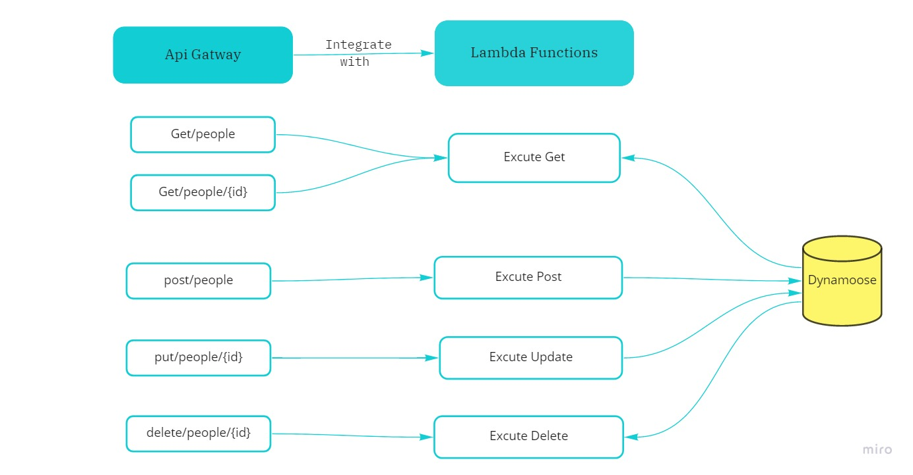

# REST-API

### 1. What is the root URL to your API?
  ```https://4i80oghpzd.execute-api.us-east-1.amazonaws.com/```


### 2. What are the routes?
|Method|Routes                    |
|------|--------------------------|
|GET   |/people                   |
|GET   |/people/{id}              |
|POST  |/people                   |
|UPDATE|/people/{id}              |
|DELETE|/people/{id}              |


### 3. What inputs do they require?
|Method|input                     |
|------|--------------------------|
|GET   |nothing                   |
|GET   |nothing                   |
|POST  |JSON obj in body          |
|UPDATE|JSON obj in body          |
|DELETE|nothing                   |


### 4. What output do they return?

|Method|OUTPUT                         |
|------|-------------------------------|
|GET   |RETURN all recored stored in DB   https://4i80oghpzd.execute-api.us-east-1.amazonaws.com/people|
|GET   |RETURN recored with match id      https://4i80oghpzd.execute-api.us-east-1.amazonaws.com/people/id  |
|POST  |RETURN posting obj             |
|UPDATE|RETURN updated obj            |
|DELETE|RETURN empty obj             |

## UML Diagram
